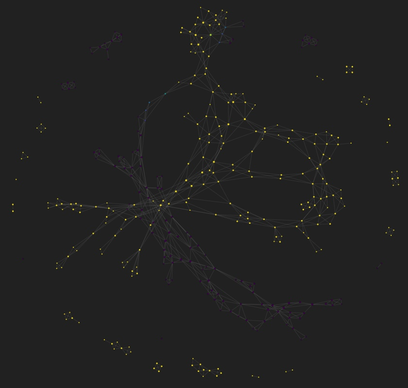

# TDA on news dataset!
Our work:
  - We perform TDA on [dataset](https://www.kaggle.com/vfomenko/russian-news-2020). We use sentence embeddings from pretrained BERT on Russian dataset
  - Visualize sentence embedding using TDA to get distributions lies in data
  - Based on previous step we fast build baseline model for text similarity.
  - Trying to apply TDA on same task

### Visualize data
Algo to visualize data:
   1. Map sentence embeddings onto 2d plane via TSNE and MinMaxScaler that data be in [0,1] square.
   2. Cover projected points by overlapping squares.
   3. For each square we clusterize data in 2 cluster by hierarchical algorithm.
   4. If clusters has the same node, we draw line.
    We perform this algorythm on 20 pairs news different text and gets similar result of this
 
 Example:

Some barcodes for sentence embeddings:

    
   

### Text similarity task
As we see mapped nodes for different news in many cases hasn't common edge. Based on this knowledge we decide to use SVM classifier to solve text retrieval task. Input is news sentence embedding and output is news_id. Based on data distribution we use 'linear' kernel. Because we visualize data only on pairs of data we decide use single-vs-single strategy for classifing news.
     
TSNE visualization:

     
     Our assumption proofs by next experiment:
     SVC with linear kernel ovo score 0.411
     SVC with default rbf kernel ovo score 0.202

### TDA in text similary
    
    We use algo to create nodes from this [paper](https://arxiv.org/abs/2003.13138):
    1. Smooth embeddings by time axis
    2. Create distance matrix based on cosine similarity
    3. Create simplitial complex and calculate persistent diagram
    4 Calculate Wasserstein distance between query diagram and all sentence diagrams.
    
Example of diagrams (query/target/not_target):
  

Wasserstein distance between query and target: 5.339
Wasserstein distance between query and non target: 11.655
